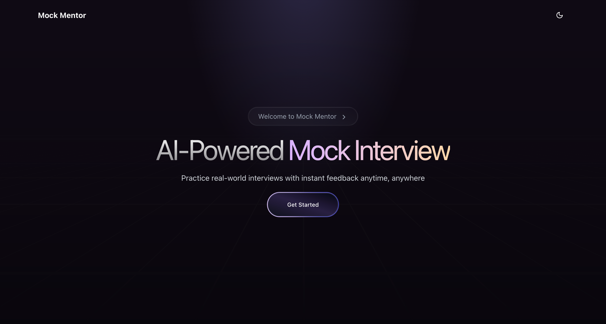
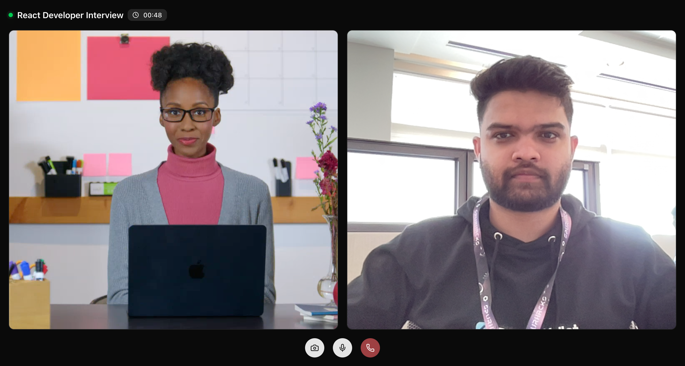

# 🎯 MockMentor - AI-Powered Interview Practice Platform

### Built at [SpurHacks 2025](https://spurhacks.com/) by [Vivek Thakur](https://vivekthakur.dev)



## 🚀 What it does

MockMentor revolutionizes interview preparation by providing personalized, real-time mock interviews with AI-powered mentors. Upload your resume, paste a job description, and practice with lifelike AI avatars that conduct tailored interviews based on your experience and the target role.

## ✨ Key Features

- **🤖 AI-Powered Avatars**: Realistic streaming video avatars that conduct natural conversations
- **📝 Smart Resume Analysis**: AI analyzes your resume to understand your background
- **🎯 Job-Tailored Questions**: Custom interview questions based on job descriptions
- **🎤 Voice Chat Integration**: Real-time voice conversations with AI mentors
- **⏱️ Timed Sessions**: 3-minute focused interview sessions
- **👥 Multiple Mentors**: Choose from various AI mentor personalities
- **📱 Responsive Design**: Works seamlessly on desktop and mobile

## 🛠️ Tech Stack

- **Frontend**: Next.js 15, React 19, TypeScript, Tailwind CSS
- **AI/ML**: Google AI SDK, OpenAI GPT, HeyGen Streaming Avatar API
- **Backend**: Next.js API Routes, MongoDB with Mongoose
- **Authentication**: Clerk
- **Real-time**: WebSocket connections for streaming
- **UI Components**: Radix UI, Lucide React icons
- **Voice**: ElevenLabs voice models, Deepgram STT

## 🎨 Screenshots



_Real-time interview session with AI mentor_

## 🏃‍♂️ Quick Start

1. **Clone the repository**

```bash
git clone https://github.com/vivekvt/mockmentor.git
cd mockmentor
```

2. **Install dependencies**

```bash
npm install
```

3. **Set up environment variables**

```bash
# Copy .env.example to .env.local and fill in your API keys
cp .env.example .env.local
```

4. **Run the development server**

```bash
npm run dev
```

5. **Open [http://localhost:3000](http://localhost:3000)**

## 🎯 How it Works

1. **Upload Resume**: AI analyzes your background and experience
2. **Add Job Description**: Paste the job you're applying for
3. **Choose Mentor**: Select from professional AI avatars
4. **Practice Interview**: Engage in real-time conversation
5. **Get Feedback**: Receive insights to improve your performance

## 🌟 What Makes it Special

- **Personalized Experience**: Every interview is tailored to your specific background and target role
- **Realistic Interaction**: Streaming avatars create an authentic interview environment
- **Instant Access**: No scheduling required - practice anytime, anywhere
- **Professional Quality**: Enterprise-grade AI technology for realistic conversations

## 🔮 Future Enhancements

- Detailed performance analytics and feedback
- Industry-specific interview modules
- Team interview simulations
- Integration with job boards

---

**Ready to ace your next interview?** [Try MockMentor Now →](https://mockmentor.vercel.app)

**Connect with the creator:**

- 🐦 [X (Twitter)](https://x.com/vivekvt_)
- 💼 [LinkedIn](https://linkedin.com/in/vivekvt)
- 📧 [Email](mailto:contact@vivekthakur.dev)
